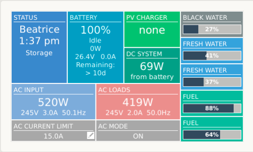

# venus-signalk-tank-service

__venus-signalk-tank-service__ represents Signal K tanks as D-Bus
services, injecting tank data from Signal K into Venus OS and 
enabling its display on the Venus GUI.

This is useful because it provides a work-around for Venus' broken
native support for CAN connected multi-channel tank sensor devices
like the Maretron FPM100 and the Garnet SeeLevel.

Although designed to address Venus' problem with multi-channel tank
sensors, the project will, of course, inject any Signal K tank data
into Venus and so make it available to devices like the CCGX.



## Background

Support for tank monitoring in Venus OS is fundamentally broken.
The OS code implementing 'socketcan' services assumes one tank sensor
device per physical tank and generates a single D-Bus tank service for
each sensor device based on this false understanding.

Consequently, a tank service in Venus that represesents a multi-channel
tank sensor device is chaotically updated with data from all the tank
sensors that are connected to the multi-channel device resulting in a
GUI rendering of the data that is unintelligible.

Somewhere in this broken-ness Venus discards tank sensor instance
numbers making disaggregation of the garbled composite data at best
problematic and, for non-trivial tank installations, infeasible.

Even so, there have been a number of attempts at implementing fixes
and work-arounds based on the timing of fluid type and tank level
data updates but this not allow disambiguation in installations which
have more than one tank of a particular fluid type.

If you have a multi-channel tank sensor on CAN and you have only one tank
of each fluid type, then look at Kevin Windrem's
[tank repeater](https://github.com/kwindrem/SeeLevel-N2K-Victron-VenusOS)
project for a fix to this problem that does not involve Signal K.

## This project

__venus-signalk-tank-service__ recovers tank data from a specified
Signal K server generating and updating one D-Bus service per tank.

Data is recovered from Signal K over HTTP.
The Signal K server can, of course, be running on a remote computer or
on the local Venus host.

The Venus GUI is tweaked to prevent display of tank data deriving from
the now redundant 'socketcan' services and some of @kwindrem's GUI
enhancements are applied because they enable a more meaningful display
of data for multiple tank installations than the stock Venus GUI.

### Installation

1. If you are installing on a CCGX, make sure that root access is
   enabled.
   
2. Install __venus-signalk-tank-service__ by logging into your Venus
   device and issuing the following commands.
   ```
   $> cd /data
   $> wget wget https://github.com/preeve9534/venus-signalk-tank-service/archive/main.tar.gz
   $> tar -xzf main.tar.gz
   $> rm main.tar.gz
   $> cd venus-signalk-tank-service-main
   ```

3. Open ```signalktank.py``` in a text editor and change the
   values of SIGNALK_SERVER and SIGNALK_TANKS to suit your needs.

   SIGNALK_SERVER specifies the hostname/IP-address and port
   number of your Signal K server.
   Use ```SIGNALK_SERVER = '127.0.0.1:3000'``` if Signal K is
   running on its default port on the Venus host.
   
   SIGNALK_TANKS specifies which tanks on SIGNALK_SERVER should
   be maintained as Venus services.
   Setting ```SIGNALK_TANKS = []``` will cause all the tanks
   available on SIGNALK_SERVER to be automatically processed.
   
   If you want to process just some tanks or you want to adjust the
   value Signal K returns for tank capacity, then you must specify the
   tanks you want to process. For example:
   ```
   SIGNALK_TANKS = [
        { 'path': 'tanks/wasteWater/0', 'factor': 1000.0 },
        { 'path': 'tanks/freshWater/1' },
        { 'path': 'tanks/freshWater/2' },
        { 'path': 'tanks/fuel/3' },
        { 'path': 'tanks/fuel/4' }
   ]
   ```
   
   Use the *path* string property to specify the self-relative Signal K
   path of a tank to be processed and, optionally, specify a decimal
   *factor* property which will be applied as a multiplier to the capacity
   value returned by Signal K.
   This latter correction can be useful if a tank sensor has been
   configured in a way that does not return tank capacity in the litre
   units required by Venus.
   
4. Run ```signalktank.py``` and check that it outputs details of the tanks
   it is configuring. My system has five tanks and I see:
   ```
   $> ./signalktank.py 
   INFO:root:registered ourselves on D-Bus as com.victronenergy.tank.signalk_192_168_1_2_3000_5_0
   INFO:root:registered ourselves on D-Bus as com.victronenergy.tank.signalk_192_168_1_2_3000_1_1
   INFO:root:registered ourselves on D-Bus as com.victronenergy.tank.signalk_192_168_1_2_3000_1_2
   INFO:root:registered ourselves on D-Bus as com.victronenergy.tank.signalk_192_168_1_2_3000_0_3
   INFO:root:registered ourselves on D-Bus as com.victronenergy.tank.signalk_192_168_1_2_3000_0_4
   ```
   If the output isn't what you expect, then check the tank data
   is actually available in Signal K and make sure that the values
   you supplied for SIGNALK_SERVER and SIGNALK_TANKS are correct.

5. With ```signalktank.py``` running you should see your configured tanks
   displaying on the Venus GUI.
   If you have a CAN connected multi-channel tank sensor on your system then
   it will still apear in the GUI at this point.
   Stop the program using 'ctrl-C'.

6. Run ```setup install``` to tweak the Venus GUI interface and make
   ```signalktank.py``` execute automatically when Venus boots.
   
   The install script adds a line to ```/data/rc.local``` (creating the file
   if it is absent), backs up the GUI files which that are to be replaced and
   installs the project versions of ```OverviewMobile.qml``` and
   ```TileTank.qml```.
   These changes persist over OS updates.
   
7. Finally, reboot Venus.
   ```
   $> reboot
   ```

If you want to revert your system to the state it was in before running
```setup install```, then you can run ```setup uninstall ; reboot```.

## Acknowledgements

Thanks to @kwindrem for making this a whole lot easier than it might have
been by reworking the Venus GUI mobile interface so nicely and in such a way
that others can leverage it.

Thanks to @mvader at Victron for being honest about the likelihood of a
manufacturer fix and and so motivating me (after four years of complaining!)
to take a different approach to getting tank data on my CCGX.

## Author

Paul Reeve \<<preeve@pdjr.eu>\>
